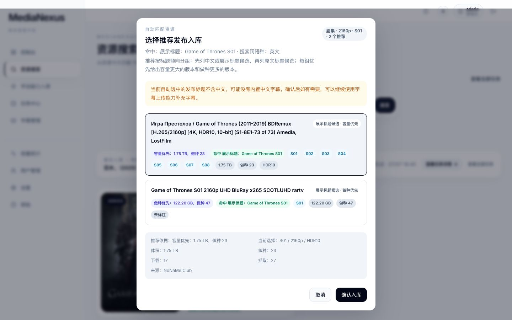

# MediaNexus 前端

MediaNexus 是面向 Emby 分享工作流的媒体管理中枢。前端负责提供资源搜索、发布资源选择、OpenList 入库任务、任务中心、失败恢复、字幕管理和公开使用说明等用户界面。

本项目不替代 CD2、AutoSymlink、Emby、VidHub、Prowlarr、Sonarr、Radarr、OpenList、PikPak、Ani-RSS 或外部资源网站，而是把这些能力串成一条更容易操作和追踪的用户路径。

## 当前用户路径

- 公开文档：未登录也可以访问 `/help`，登录页和侧边栏“帮助”都指向同一份说明。
- 资源搜索：优先从电影、电视剧、动漫目录结果开始，确认作品后再选择发布资源。
- 自动发布选择：点击卡片上的入库按钮后，会先出现推荐确认弹窗，不会静默创建任务。
- 发布资源选择：点击“查看更多”进入 Prowlarr 发布结果列表，按分辨率、HDR、Dolby Vision、SDR 等标签筛选。
- 动漫整季入库：用于一次性创建 OpenList 入库任务。
- 动漫追更订阅：走 Ani-RSS 订阅路线，不属于任务中心里的 OpenList 入库日志。
- 手动磁力入库：作为兜底入口，适合已有可靠 magnet、发布搜索不理想或失败恢复时换来源。
- 任务中心：统一查看电影、剧集和动漫整季 OpenList 入库任务，支持状态、类型、来源和关键词筛选。
- 字幕管理：用于在入库后补充字幕，解决没有字幕、语言不对或时间轴不匹配的问题。

## 界面示例

### 资源搜索

输入片名后先确认卡片上的标题、年份、海报和简介，再选择分辨率并决定走推荐入库还是查看更多。


### 推荐确认

点击剧集入库后会先打开推荐确认弹窗。用户可以检查推荐候选、推荐依据、体积、做种、动态范围、来源和字幕风险，再决定取消或确认。



### 发布资源选择

点击查看更多后进入发布资源选择页。这里可以对比多个 Prowlarr 返回的发布资源，再手动选择其中一个入库。


### 任务中心

任务中心用于离开原入口后继续跟踪 OpenList 入库任务。


### 字幕管理

字幕管理用于上传并关联字幕文件。外部字幕来源可以参考 SubHD，但上传前仍需要自己核对字幕版本是否匹配当前片源。


## 外部工具与来源边界

- SeedHub：https://www.seedhub.cc/
  可以作为手动磁力来源之一。复制 magnet 前需要自己核对作品、年份、季集、清晰度、体积、字幕信息和做种情况。
- SubHD：https://subhd.tv/
  可以作为字幕来源之一。下载字幕前需要自己核对片名、年份、季集、版本组、片长和帧率。
- Prowlarr：用于发布资源搜索。发布搜索通常需要十几秒，慢时可能接近 30 秒。
- OpenList：用于离线下载和入库任务执行。
- Ani-RSS：用于动漫追更订阅。

MediaNexus 会尽量保留来源上下文，例如发布标题、索引器、分辨率和动态范围，但不会替外部资源网站背书。手动磁力和手动字幕都需要用户自行判断来源是否可靠。

## 本地开发

```bash
npm install
npm run dev
```

默认开发地址为：

```text
http://localhost:5173
```

前端通过 Vite 代理访问 Java 后端：

```text
/java-api -> http://localhost:8080
```

## 环境变量

开发环境可参考 `.env.example`：

```bash
VITE_API_BASE_URL=http://127.0.0.1:8000
VITE_JAVA_API_BASE_URL=/java-api
```

生产部署建议让 Java 后端与前端保持同源，并通过 `/java-api` 转发：

```bash
VITE_JAVA_API_BASE_URL=/java-api
```

如果 `MediaNexus-Core` 暂未部署，可以让 `VITE_API_BASE_URL` 为空，避免生产页面误打到本地开发地址。参见 `.env.production.example`。

## 验证约定

本仓库默认不运行全项目构建、全量类型检查、全量 Lint 或全量测试。修改文档或单个页面时，优先运行最小相关检查，例如：

```bash
npx eslint src/pages/docs/index.tsx --ext ts,tsx
```

## 相关项目

- `MediaNexus-Orchestrator`：Java 后端，提供认证、资源搜索、发布资源推荐、OpenList 入库编排、任务中心、字幕管理等 API。
- `MediaNexus-Core`：旧 Python 后端，部分旧能力仍可能由它承载。
